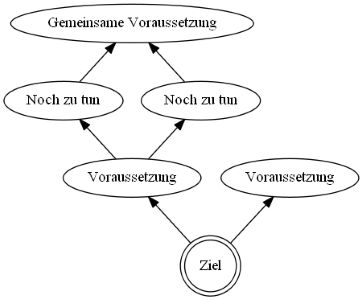
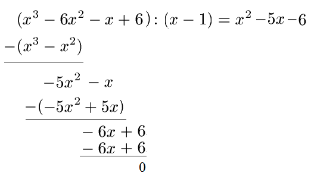
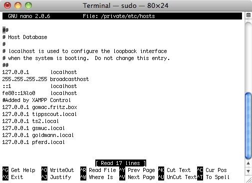

- title : Die Mikado Methode
- description : Beherrschen von Legacy Code mit Hilfe der Mikado Methode
- author : Jörg Preiß
- theme : sky
- transition : default

***

### Die Mikado-Methode

***

### Vorstellung

- Jörg Preiß
- Twitter: @joergpreiss
- Interessensgebiete: Sprachen, Architektur

' - Programmiert seit 25 Jahren
' - Mischen von C#, F#, Java, Prolog

***

### Um was geht es?

- von Ona Ellnestam, Daniel Brolund
- Artikel von Stefan Lieser
- Wie renoviere ich eine Wohnung, während darin eine Party läuft?

' - Frage ob bekannt!
' - Kurzer Theorieblock, um alle abzuholen

***

### Wie sieht es aus?

- Man beginnt mit einem Ziel
- Für Ziel Voraussetzungen bestimmen
- Rekursiv für alle Voraussetzungen weitermachen

' - Ziel muss messbar, erreichbar sein
' - Knoten ohne Voraussetzungen sind Blätter
' - Visualisierung digital oder analog
' - Umsetzung bei Blättern beginnen

***

### Wie geht man vor?

- These der Verbesserungsmöglichkeit
- Versuchsweise Umsetzung
- Beobachtung der Auswirkungen

' Man experimentiert also
' 1. Indikator: Compiler
' 2. Indikator: Unit-Tests
' Bei jedem Durchlauf bisheriges Ergebnis löschen!

***

### Wann setzt man es ein?

- Neuen Code kennenlernen
- Alten Code überarbeiten
- Neue Technologien benutzen
- Allgemein: bei Umstrukturierungen

' - Shell von Abhängigkeiten befreien, aber Release steht bevor
' - Wem sein alter Code noch gefällt, hat zu wenig gelernt
' - Aspekt der Dokumentation

***

### Was bringt es?

- Mikado-Graph ist ausgelagertes Gedächtnis
- Kann als Dokumentation benutzt werden
- Änderungen jederzeit durchführbar/nachvollziehbar

' Dokumentaton bei Besprechungen oder im Repo
' Branch erzeugt, Änderungen gemacht, Merge verschoben
' Jeden Änderung einzeln durchführbar

***

### Bisherige Beispiele

- Durch Erklärung der Feinheiten zu wenig Zeit
- Beliebt: einzelne Funktionen in neue Klasse auslagern
- Gehen wirklich größere Umbauten?

***

### Gezeigtes Beispiel

- Prism: Framework für WPF 
- Unity: IoC-Container von Prism
- Codeänderung nicht wirklich relevant

' Projekt zeigen
' Wer ist für Neuentwicklung?

***

***

### Auswirkungen

- Trennung von Denk- und Umsetzungszeit
- Umsetzungszeit nur ein Bruchteil
- Größter Teil ist Forschung

' - Mit der Gummiente reden
' - weiterer Aspekt: Abschätzungen genauer

***

### Alles wegwerfen?

- Sorgfältig vorgehen
- Codesnippets erzeugen
- Batches/Skripte verwenden

' Pragmatisch vorgehen aber sorgfältig auswählen
' Keine strukturellen Änderungen einchecken

***

### Ausgangsthese

- Wohnung nicht neu eingerichtet
- Aber bereits alle Möbel davor
- Alles bereit zur Umsetzung

' Build kann nicht gebrochen werden
' Dennoch: Integrationstests wichtig

***

### Größer denken

- der Weg ist das Ziel
- Software lebt
- roter Faden zur weiteren Entwicklung

' wer den Weg nicht kennt, kann das Ziel nicht finden

***

### Anwendungsfall

Bei der Installation von OS/Programmen:
Weg zur aktuellen Konfiguration aufzeichnen

' Weniger Probleme bei Update
' Keine strukturellen Änderungen einchecken

***

### Fragen?

***

