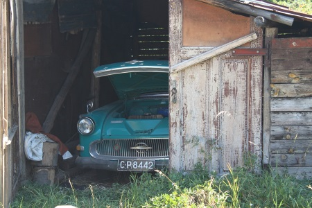

- title : Die Mikado Methode
- description : Beherrschen von Legacy Code mit Hilfe der Mikado Methode
- author : Jörg Preiß
- theme : sky
- transition : default

***

### Vorstellung

- Jörg Preiß
- Twitter: @joergpreiss
- Interessensgebiete: Sprachen, Architektur

' Programmiert seit 25 Jahren
' Pascal, C, C++, C#, F#, Java, Prolog

***

### Um was geht es?

- von Ona Ellnestam, Daniel Brolund
- Artikel von Stefan Lieser
- Wie richte ich ein Zimmer neu ein, während eine darin Party läuft?

***

### Wie sieht es aus?

- Man beginnt mit einem Ziel
- Für jedes Ziel Voraussetzungen bestimmen
- Rekursiv für alle Voraussetzungen weitermachen

' Ziel muss messbar, erreichbar sein
' Knoten ohne Voraussetzungen sind Blätter

***

### Wie geht man vor?

- These der Verbesserungsmöglichkeit
- Versuchsweise Umsetzung
- Beobachtung der Auswirkungen

' Man experimentiert also
' hilfreich: Unit-Tests
' Genau das was man täglich macht

***

### Für wen ist es?

- Neu in einer Firma angefangen
- Alten Code von vor 2 Jahren überarbeiten
- Allgemein: bei allen Strukturierungsmaßnahmen

' Shell von Abhängigkeiten befreien, aber Release steht bevor
' Wem sein alter Code noch gefällt, hat zu wenig gelernt
' Aspekt der Dokumentation

***

### Was bringt es?

- Mikado-Graph ist ausgelagertes Gedächtnis
- Kann als Dkumentation benutzt werden
- Änderungen jederzeit durchführbar/nachvollziehbar

' Dokumentaton bei Besprechungen oder im Repo
' Branch erzeugt, Änderungen gemacht, Merge verschoben
' Jeden Änderung einzeln durchführbar

***

### Bisherige Beispiele

- Durch Erklärung der Feinheiten zu wenig Zeit
- Beliebt: einzelne Funktionen in neue Klasse auslagern
- Gehen wirklich größere Umbauten?

***

***

### Ausgangsthese

- Zimmer nicht neu eingerichtet
- Aber bereits alle Möbel davor
- Alles bereit zur Umsetzung

***

### Größer denken

- der Weg ist das Ziel
- Software lebt
- roter Faden zur weiteren Entwicklung

' wer den Weg nicht kennt, kann das Ziel nicht finden

***

